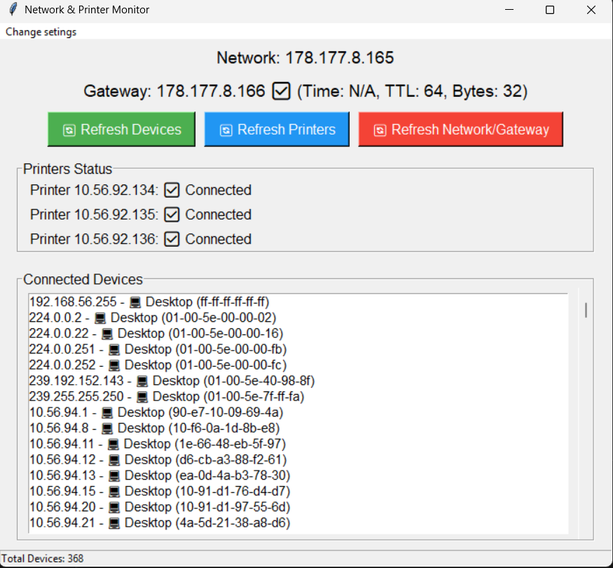

# Network and Printer Monitor



برنامج مكتبي لمراقبة الشبكة وحالة الطابعات مع إشعارات محلية.

## مميزات
- فحص الشبكة واكتشاف جميع الأجهزة.
- مراقبة اتصال الطابعات.
- إرسال إشعارات محلية عند فقد الاتصال.

## طريقة التشغيل
1. تثبيت المتطلبات:
   ```
   pip install -r requirements.txt
   ```
2. تشغيل البرنامج:
   ```
   python main.py
   ```
